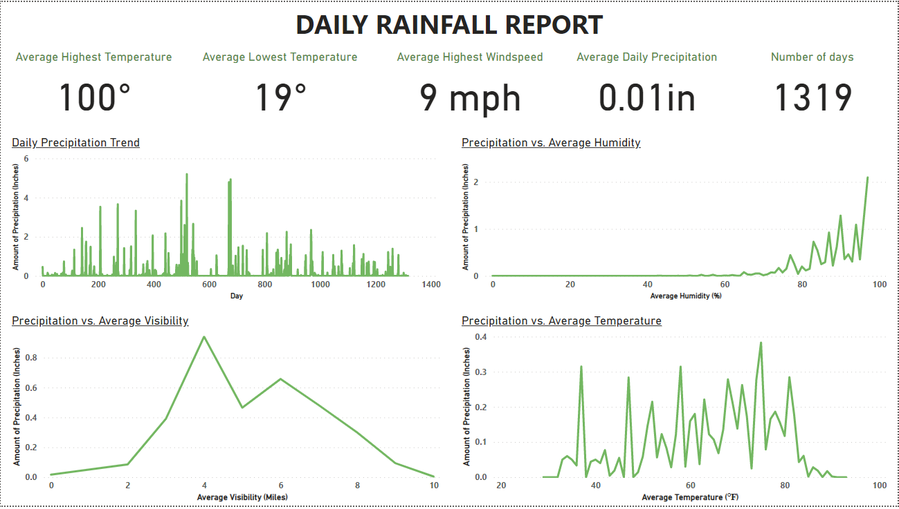

## Demo


## Installation

Install my-project with npm

```bash
  npm install my-project
  cd my-project
```
    
## Deployment

To deploy this project run

```bash
  npm run deploy
```


## Data Visualization





